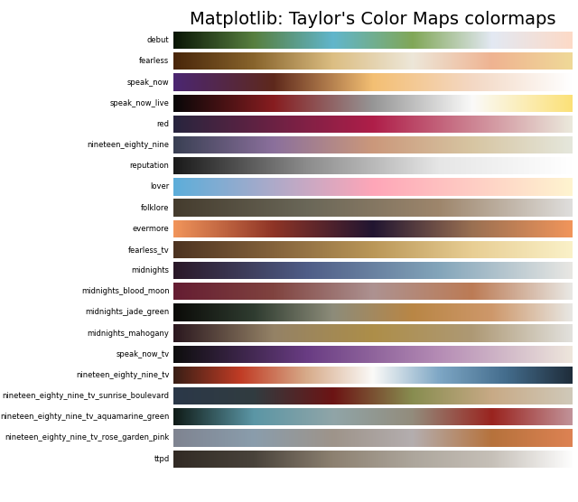

## Taylor Swift color map collection.

[](https://doi.org/10.5281/zenodo.5649259)

Quick start: `pip install swiftascmaps`

Includes color maps based on the following albums:

+ Debut (`debut`, `debut_r`) (copied from [taloRswift](https://github.com/asteves/tayloRswift))
+ Fearless (`fearless`, `fearless_r`) (copied from [taloRswift](https://github.com/asteves/tayloRswift))
+ Speak Now (`speak_now`, `speak_now_r`) (copied from [taloRswift](https://github.com/asteves/tayloRswift))
+ Speak Now: World Tour Live (`speak_now_live`, `speak_now_live_r`) (copied from [taloRswift](https://github.com/asteves/tayloRswift))
+ Red (`red`, `red_r`)
+ 1989 (`nineteen_eighty_nine`, `nineteen_eighty_nine_r`)
+ Reputation (`reputation`, `reputation_r`)
+ Lover (`lover`, `lover_r`)
+ Folklore (`folklore`, `folklore_r`)
+ Evermore (`evermore`, `evermore_r`, `evermore_shifted`, `evermore_shifted_r`)
+ Fearless: Taylor's Version (`fearless_tv`, `fearless_tv_r`)
+ Red: Taylor's Version (`red_tv`, `red_tv_r`)
+ Midnights (`midnights`, `midnights_r`)
+ Midnights - Blood Moon Variant (`midnights_blood_moon`, `midnights_blood_moon_r`) (copied from [taloRswift](https://github.com/asteves/tayloRswift))
+ Midnights - Jade Green Variant (`midnights_jade_green`, `midnights_jade_green_r`) (copied from [taloRswift](https://github.com/asteves/tayloRswift))
+ Midnights - Mahogany Variant (`midnights_mahogany`, `midnights_mahogany_r`) (copied from [taloRswift](https://github.com/asteves/tayloRswift))
+ Speak Now: Taylor's Version (`speak_now_tv`, `speak_now_tv_r`)
+ 1989: Taylor's Version (`nineteen_eighty_nine_tv`, `nineteen_eighty_nine_tv_r`)
+ 1989: Taylor's Version - Sunrise Boulevard Variant (`nineteen_eighty_nine_tv_sunrise_boulevard`, `nineteen_eighty_nine_tv_sunrise_boulevard_r`)
+ 1989: Taylor's Version - Aquamarine Green Variant (`nineteen_eighty_nine_tv_aquamarine_green`, `nineteen_eighty_nine_tv_aquamarine_green_r`)
+ 1989: Taylor's Version - Rose Garden Pink Variant (`nineteen_eighty_nine_tv_rose_garden_pink`, `nineteen_eighty_nine_tv_rose_garden_pink_r`)

License: LGPLv3
Author: Josh Borrow (josh@joshborrow.com)

If you prefer to use `R`, there is an alternative package
maintained as [taloRswift](https://github.com/asteves/tayloRswift).

Usage
-----

To use these, you can import them and use them
with matplotlib as you would with any other color map.

```python
from swiftascmaps import red
from matplotlib.pyplot import imshow
from numpy import random

imshow(random.rand(128, 128), cmap=red)
```

The color maps can also be accessed in matplotlib using strings
by prefixing `swift`, e.g.

```python
import swiftascmaps

imshow(random.rand(128, 128), cmap="swift.red")
```

Examples
--------



Note
----

Of course, these aren't necessarily designed to be colorblind
friendly, or perceptually uniform, so use them with caution.
They are quite pretty though. To underline how much you should
_not_ use these in a real scientific publication (apart from
perhaps qualitative imaging), the lightness values are shown
below.


For quantitative comparisons, please ensure that you use a
perceptually uniform colour map (see e.g. those available
directly through [matplotlib](https://matplotlib.org/3.1.0/tutorials/colors/colormaps.html)).
